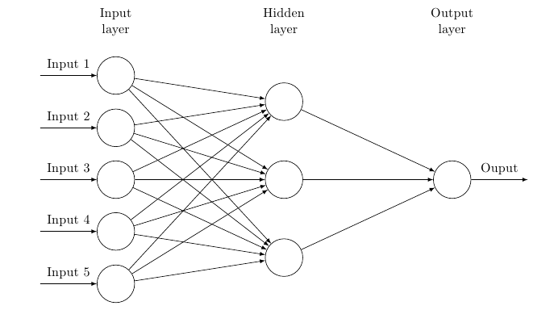

# pytorch-intro 


# Setup 
Pytorch setup - https://pytorch.org/get-started/locally/
Install via conda ```conda install pytorch torchvision -c pytorch```, note that OSX doesnt support cuda, need eGPU/Cloud GPU


# Neural Networks


<p style="text-align: center;"></p>
    
</p>
<small>Fig 1: Neural Network</small>
<br/>
<br/>

Descriptive features are converted to numerical values which are used as the inputs to the neural network.
Hidden layers are called 'hidden' because we don't have control over them, we can see whats going on within them but we don't change any values within
hidden layers. 
Output in the general sense, outputs multiple numerical values and whichever one is greatest (argmax(outputs)), then that output is the prediction, for example say we have three outputs Dogs: 13, Cats: 2, Human: 21, then because human has the greatest output, we say that the prediction is a human.

Every input and neuron are connected via a line, when all inputs are connected to all neurons, we then have a Fully Connected Network. Each line/connection is really a weight. The input value is multiplied by a weight, a bias is optionally added in, a bias could be anything like 3, so ```(input * value) + 3```, the result is then passed to another neuron.

<br/>
<p style="text-align: center;"></p>
    
</p>
<small>Fig 2: Neuron</small>
<br/>
<br/>

A single neuron accepts multiple inputs, each input is multiplied by a weight and a bias is possibly added, then all results are summed together (&epsilon;) and then passed through an activation function (ƒ). 
The activation function is what mimics a neuron in your brain, it either fires off or doesn't is what a stepper function looks for. We'll most commonly use a sigmoid function which outputs a range from 0 to 1, which also mimics firing or not, the fact that it uses a range between 0 and 1 helps as the inputs are also between 0 and 1.


### Closing
Each of these weights and biases is what is called a parameter, if you see how many connections there are you can deduce that there are a lot of parameters, a weight and a bias is one paramater, so if we have a bias then each connection can have two parameters. The machine can modify each weight independently with the goal of fitting to our desired output, for example training a network to recognize a human in an image, if we have three outputs, Dog, Cat and Human, we would want our ouput to be ```[0,0,1]```. 

A neural network is then just a giant function where we allow the machine to tweak variables and parameters to output desired results.